# EASTERN BIOCHEMICALS PRIVATE LIMITED — Complete Build Specification

**Project:** Corporate website + dedicated single-vendor e-commerce store + Admin/ERP panel
**Built with:** AI coding tool (Anti-gravity) · Auth: Firebase · **Database: Firebase Firestore** · Media: Cloudinary · **Payments: COD / manual transfer only (no online gateway in v1)**
**Document set:** 1 PRD · 2 TRD · 3 App Flow · 4 UI/UX Brief · 5 Backend Schema · 6 Implementation Plan
**Version:** 1.1 (revised: Firestore instead of dedicated DB; online payment gateway removed) · **Date:** 01 Oct 2026

> **How an AI coding agent must use this file:** Read Section 0 first (assumptions and rules). Then build strictly in the order of Section 6. Every other section is the source of truth for what to build. If something is not specified, pick the simplest option consistent with this document and record it in `/docs/DECISIONS.md`. Do not ask the user unless blocked.

---

## TABLE OF CONTENTS
0. Assumptions, Rules & Open Items
1. PRD — Product Requirements Document
2. TRD — Technical Requirements Document
3. App Flow (with flowcharts)
4. UI/UX Brief (with layouts)
5. Backend Schema (Firestore)
6. Implementation Plan (phases + deliverables)
7. Appendix — AI agent prompt pack & Definition of Done

---

# 0. ASSUMPTIONS, RULES & OPEN ITEMS

## 0.1 Company facts (use as seed/content)

| Field | Value |
|---|---|
| Legal name | EASTERN BIOCHEMICALS PRIVATE LIMITED |
| CIN | U47721TR2025PTC014575 |
| Registration no. | 14575 |
| Incorporated | 27 May 2025 · Private company limited by shares · Non-government |
| ROC | Guwahati |
| Authorised capital | ₹10,00,000 · Paid-up capital ₹1,00,000 |
| Status | Active · Unlisted |
| Registered office | 066320, East Chandmari, Vivekananda Sarani, Sadar, West Tripura, Tripura – 799006, India |
| Secondary / operating address given | Villa 171, VGN Grandeur, Keshavardhini Nagar, Periya Kolathuvancheri, Iyyappanthangal, Chennai, Tamil Nadu – 600122 |
| Email / phone / GSTIN | **Not provided — placeholders in Settings** |

## 0.2 Assumptions (made so the build does not stall)

| # | Assumption | Impact if wrong |
|---|---|---|
| A1 | **One Next.js app** with 3 areas: Corporate site (`/`), Store (`/shop/*`), Admin (`/admin/*`). | Can later split the store to `shop.<domain>` via a middleware rewrite. No code change. |
| A2 | **Single vendor** — only Eastern Biochemicals sells; no marketplace sellers. | None. |
| A3 | Domestic India only (INR, GST). | International shipping out of scope for v1. |
| A4 | **Database = Firebase Firestore** (server-side access only via Admin SDK). **No separate/dedicated database** (no PostgreSQL/Prisma). Media = Cloudinary. Auth = Firebase Auth. | Reports use pre-aggregated daily stats because Firestore has no joins/GROUP BY (§5.8). |
| A5 | **No online payment gateway in v1.** Payment methods: **Cash on Delivery** + optional **manual UPI/bank transfer** that admin verifies. A `PaymentProvider` interface lets a gateway be added later. | Adding Razorpay etc. later = one new provider + webhook. |
| A6 | Shipping is **manual** (courier name + AWB entered in admin). Shiprocket is an optional later adapter. | None. |
| A7 | **Home-state for GST** is configurable in Settings (default: Tripura, state code 16). Chennai office can be added as a second business location. | GST invoice logic reads this value. |
| A8 | Turnover is below the e-invoicing (IRN) threshold → **IRN/e-way bill is optional, not in v1.** Hooks provided. | Add GSP integration in v2. |
| A9 | Product catalogue = **health & wellness / consumer healthcare / biochemical products**. Categories are **admin-managed**, nothing hard-coded. | None. |
| A10 | **Regulatory flags** exist per product: `requires_prescription`, `age_restricted_18plus`. Age-gate and prescription-upload are built in but **off by default**. | Confirm with a compliance advisor which products need them before going live. |
| A11 | Email via **Resend** (or Brevo). SMS/WhatsApp notifications via a provider adapter (v2). WhatsApp "Chat Now" floating button = simple `wa.me` link in v1. | — |
| A12 | Hosting: **Vercel** (app) + **Firebase** project (Auth + Firestore, Blaze plan for scheduled backups) + **Cloudinary** (media). Backups = Firestore managed export to a GCS bucket. | — |
| A13 | Languages: English only. Fully responsive (mobile-first). | — |
| A14 | The reference sites (Mankind Pharma, Manforce Epic) are **layout/UX references only**. Do **not** copy their logos, trademarks, product images, copy or text. Use Eastern Biochemicals' own branding, with a placeholder logo until supplied. | Legal/trademark risk if copied. |
| A15 | Candidates apply **without needing an account** (name, email, phone, CV). Optional login shows application history. | — |

## 0.2.1 Items to supply later (do NOT block the build)
GSTIN, PAN, company email/phone, final logo (SVG), brand colours (if different), product list with HSN codes & GST rates, bank details for invoices, Firebase/Cloudinary/Resend keys (and Shiprocket only if used), privacy policy/terms text, real photography.

## 0.3 Non-negotiable engineering rules for the AI agent
1. TypeScript strict mode. No `any` unless commented.
2. All money stored as **integers in paise** (₹499.00 → `49900`). Never floats.
3. Every admin API verifies: valid Firebase ID token → user profile exists in Firestore → role has permission. **Never trust the client.**
4. Stock changes happen **only** through `stock_movements` (append-only ledger) inside a Firestore transaction.
5. Invoices are **immutable** once issued. Corrections = credit note.
6. All forms validated with **Zod** on client and server.
7. Secrets only in environment variables; never committed.
8. Every document has `createdAt`, `updatedAt`; sensitive actions write to `audit_logs`.
9. Accessibility: WCAG 2.1 AA basics (contrast, labels, keyboard nav, alt text).
10. Each phase ends with passing lint, typecheck, and tests before the next starts.
11. **Firestore is accessed only from the server (Admin SDK).** Security rules deny all client access. No SQL/Prisma, no payment-gateway SDKs in v1.

---

# 1. PRD — PRODUCT REQUIREMENTS DOCUMENT

## 1.1 Vision
One platform that (a) presents Eastern Biochemicals as a credible healthcare company, (b) sells its products directly to consumers, and (c) runs the company's back office — inventory, GST billing, purchasing, finance, CRM, HR hiring and analytics — from a single secure admin panel.

## 1.2 Goals & success metrics

| Goal | Metric (first 90 days after launch) |
|---|---|
| Credible online presence | Lighthouse ≥ 90 (Perf/SEO/A11y), pages indexed |
| Direct sales | Checkout conversion ≥ 2%, COD delivery success ≥ 90% |
| Operational efficiency | GST invoice generated automatically for 100% of paid orders |
| No stock-outs | Low-stock alert fires before quantity hits zero for 100% of tracked SKUs |
| Hiring | Applications received & managed fully in admin (no email attachments) |
| Reliability | 99.5% uptime, daily backup success 100% |

## 1.3 Users & personas

| Persona | Needs |
|---|---|
| **Visitor** | Learn about the company, products, certifications, contact, careers |
| **Customer** | Browse, search, buy, pay, track order, download invoice, reorder, review |
| **Job candidate** | See openings, apply with CV, get confirmation |
| **Super Admin (owner)** | Full control, reports, backups, user roles |
| **Sales Manager** | Orders, customers, leads, sales dashboard |
| **Inventory Manager** | Products, stock, batches, purchase orders, suppliers |
| **Accountant** | Invoices, expenses, GST reports, payments |
| **HR/Recruiter** | Job posts, applications, candidate pipeline |
| **Content Editor** | Pages, banners, blogs, SEO |

## 1.4 Scope — three products in one

### A. Corporate website (public) — mirrors the "company profile" reference
- Home (hero video/image with big headline, scroll cue, announcement bar)
- Company (About, Vision/Mission, Leadership, CIN/legal info), Our Promise (Quality · Affordability · Accessibility style 3-card block)
- R&D & Innovation (stat cards, highlights), Business Verticals (icon cards)
- Safety & Sustainability (carousel cards), Certifications
- International / Distributors enquiry
- Investor Center → renamed **Corporate Info** (company details, CIN, documents download) *(unlisted company; no stock ticker)*
- Careers (Join-us block → open positions → job detail → apply)
- Blog / News
- Contact + Get in touch (form, address, map)
- Footer: contact info, quick links, social, legal links, copyright
- **"Shop" button in the top nav → opens the dedicated store**

### B. E-commerce store (public + customer) — mirrors the "Epic" reference
- Separate look-and-feel & header (Shop · Blogs · Track Order | centred logo | search · account · cart)
- Home: hero slider, "zone" category circles, trending products with discount badges, featured product, comparison/story banner, testimonials, WhatsApp chat button
- Collections (category grid with product counts), collection page with filters/sort
- Product page: gallery, price/MRP/discount, rating, stock status, quantity, **Add to cart**, **Buy now**, pincode check, share, details accordion, reviews with photos, "You may also like", sticky add-to-cart bar
- Cart (drawer + page), Checkout (guest or logged in), Cash on Delivery / optional manual UPI-bank transfer
- Account: login/register/forgot password, orders, addresses, wishlist, invoices
- **Track Order** (order number + phone/email, no login)
- Blogs (category chips, cards with "Know more")
- Policy pages: Privacy, Terms, Delivery & Returns, Warranty, Legal Notice, Support ticket

### C. Admin panel (private) — all backend modules requested

| # | Module | Key capabilities |
|---|---|---|
| 1 | Inventory & Stock | SKUs, batches, expiry, stock in/out, adjustments, multi-location (optional), history |
| 2 | Finance & Billing | Payments ledger, COD collection reconciliation, receivables/payables, outstanding, manual refunds |
| 3 | GST Invoice | Auto/manual invoices, CGST/SGST/IGST, HSN, PDF, credit notes, numbering |
| 4 | Sales Dashboard | KPIs, charts, top products, channel split |
| 5 | Purchase Mgmt | PO create → approve → send → GRN → bill → stock-in |
| 6 | CRM | Customers, segments, notes, interactions, leads, enquiries |
| 7 | Supplier Mgmt | Supplier master, price history, performance, payables |
| 8 | Expense Mgmt | Categories, weekly/monthly views, receipts, recurring |
| 9 | Low Stock Alerts | Thresholds, in-app + email alerts, reorder suggestions |
| 10 | Reports & Analytics | **Weekly / Monthly / Yearly** sales, GST (GSTR-1 style summary), stock, expense, P&L-lite; export CSV/XLSX/PDF |
| 11 | Roles & Permissions | RBAC matrix, user invites, activate/deactivate |
| 12 | Backup & Security | Scheduled Firestore backup, manual backup, audit log, session & access controls |
| 13 | Careers (HR) | Job posts, applications, status pipeline, notes, CV download |
| 14 | Content/CMS | Banners, pages, blogs, testimonials, SEO fields, site settings |
| 15 | Orders & Fulfilment | Order list, status updates, shipment/AWB, returns/refunds |

## 1.5 Functional requirements (numbered, testable)

**Corporate site**
- FR-C1 Nav with Company, R&D & Innovation, Safety & Sustainability, International, Corporate Info, Careers, **Shop**, hamburger menu.
- FR-C2 Announcement bar editable from admin.
- FR-C3 Hero supports video or image, headline, scroll indicator.
- FR-C4 All page content (text, images, stats, vertical cards) editable via admin CMS.
- FR-C5 Contact form stores enquiry in Firestore + emails admin.
- FR-C6 Careers: list, filter (department/location/type), detail, apply form (name, email, phone, CV PDF ≤ 5 MB, cover note, links), auto-acknowledgement email.

**Store**
- FR-S1 Clicking **Shop** in the corporate nav navigates to `/shop` and switches to the Store layout (different header/footer/theme). A "Back to Company site" link exists in the store footer/header.
- FR-S2 Product listing: filter (category, price, rating, in-stock), sort, pagination/infinite scroll, search with suggestions.
- FR-S3 Product price display: selling price, struck-through MRP, "Save X%" badge computed.
- FR-S4 Stock status badge: *In stock, ready to ship* / *Only N left* / *Out of stock* (disable buy).
- FR-S5 Pincode serviceability check on product page.
- FR-S6 Cart persists (guest: localStorage + server cart on login merge).
- FR-S7 Checkout: address, shipping method, coupon, payment (**Cash on Delivery**, optional manual UPI/bank transfer), order summary, GST-inclusive pricing shown.
- FR-S8 After the order is placed: order confirmation page, email, **GST invoice PDF auto-generated** and downloadable.
- FR-S9 Track Order: order number + (phone or email) → status timeline.
- FR-S10 Reviews: only verified buyers; rating, text, photos (Cloudinary); admin moderation.
- FR-S11 Wishlist (logged-in).
- FR-S12 Age-gate modal & prescription upload when flags are set (see A10).
- FR-S13 Floating WhatsApp "Chat Now" button on all store pages.

**Admin**
- FR-A1 Login via Firebase (email+password, optional Google); admin area only for staff roles.
- FR-A2 RBAC enforced on every page and API.
- FR-A3 Stock decrements at order **placement** (atomic Firestore transaction), restores on cancel/return/unpaid timeout.
- FR-A4 Low-stock alert when `available <= reorder_level`; daily digest email.
- FR-A5 Invoice numbering `EBPL/{FY}/{0001}` sequential per financial year (Apr–Mar), no gaps.
- FR-A6 GST: if `place_of_supply == business_state` → CGST+SGST else IGST.
- FR-A7 Reports with date presets: This week, This month, This year, Custom; export CSV/XLSX/PDF.
- FR-A8 Backups: nightly automated + on-demand; list with status; restore procedure documented.
- FR-A9 Audit log for create/update/delete on money, stock, roles, settings.

## 1.6 Non-functional requirements
Performance (LCP < 2.5 s on 4G), SEO (SSR/ISR, sitemap, structured data for Product/Organization/JobPosting), security (OWASP Top 10, rate limiting, CSRF safe, input sanitisation), privacy (DPDP Act 2023 consent, data deletion request flow), scalability (≥ 50k products/orders without redesign), observability (Sentry + logs), accessibility (WCAG 2.1 AA).

## 1.7 Out of scope (v1)
**Online payment gateway (planned later)**, marketplace multi-vendor, mobile native apps, multi-currency, e-invoice IRN/e-way bill, loyalty points, subscription billing, full double-entry accounting (Tally export is v2).

## 1.8 Risks
| Risk | Mitigation |
|---|---|
| Regulatory rules for certain health products | Compliance flags + admin toggle; legal review before launch |
| GST miscalculation | Unit tests on tax engine; accountant UAT |
| Stock oversell | Firestore transaction deducts stock atomically at order placement; concurrency test in Phase 6 |
| COD fake orders / RTO losses | COD rules: max value, allowed pincodes, per-phone limits, optional OTP; manual-transfer orders auto-cancel after 24 h |
| Firestore cost / no joins | Pre-aggregated `stats_daily`, ISR caching, cursor pagination, budget alerts |
| Trademark misuse from references | Own branding only (A14) |

---

# 2. TRD — TECHNICAL REQUIREMENTS DOCUMENT

## 2.1 Tech stack

| Layer | Choice | Reason |
|---|---|---|
| Framework | **Next.js 15 (App Router) + React + TypeScript** | SSR/ISR for SEO, one codebase for 3 areas |
| Styling | **Tailwind CSS + shadcn/ui + Lucide icons** | Fast, consistent UI |
| State/data | TanStack Query (admin), Zustand (cart), React Hook Form + Zod | |
| Auth | **Firebase Authentication** (client SDK) + **Firebase Admin SDK** (server-side token/session verify) | As requested |
| **Database** | **Firebase Firestore** (accessed **server-side only** via Admin SDK) | As requested — no separate SQL/dedicated database |
| Media | **Cloudinary** (signed uploads, transformations, CDN) — images, videos, CVs, invoice PDFs | As requested |
| **Payments** | **No online payment gateway in v1.** Supported methods: **Cash on Delivery (COD)** and optional **manual UPI / bank transfer** (admin verifies and marks paid). A `PaymentProvider` interface is built so a gateway can be plugged in later. | As requested |
| Shipping | Manual courier + AWB entry in admin (v1). Shiprocket adapter = optional later | Keeps v1 simple |
| Email | Resend + React Email templates | |
| PDF | `@react-pdf/renderer` (invoices, POs, reports) | |
| Charts | Recharts | |
| Excel/CSV | `exceljs`, `papaparse` | |
| Jobs/cron | Vercel Cron (low-stock digest, backup export, recurring expenses, unpaid-order auto-cancel) | |
| Rate limit | Upstash Redis (optional) or Firestore-based counter fallback | |
| Monitoring | Sentry + Vercel Analytics | |
| Testing | Vitest (unit), Playwright (e2e), **Firebase Emulator Suite** (Auth + Firestore locally) | |
| Hosting | Vercel (app) + Firebase project (Auth, Firestore; **Blaze pay-as-you-go plan required** for scheduled backups/exports) + Cloudinary | |
| Backups | **Firestore managed export** to a Google Cloud Storage bucket + Point-in-Time Recovery | See §2.6-f |

**Explicitly NOT used in v1:** PostgreSQL, Prisma, Neon/Supabase, Razorpay or any payment gateway, Firebase Storage (Cloudinary replaces it), Cloudflare R2.

## 2.2 System architecture

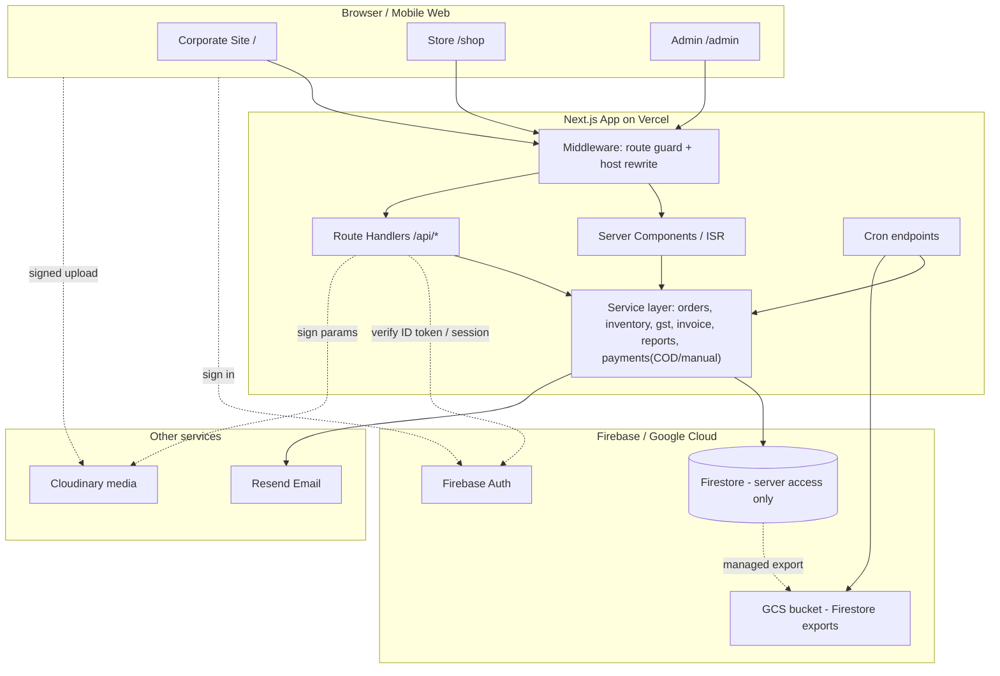

**Key architectural decision:** browsers **never talk to Firestore directly**. Firestore Security Rules are set to **deny all client access**; every read/write goes through Next.js server code (Admin SDK) after the session cookie and RBAC check. This keeps pricing, stock, GST and roles tamper-proof.

## 2.3 Routing map (single repo, route groups)

```
/ (public)                      → Corporate layout (navy/purple theme)
  /about  /company/*  /rnd  /sustainability  /international  /corporate-info
  /careers  /careers/[slug]  /careers/[slug]/apply
  /blog  /blog/[slug]  /contact
/shop (store)                   → Store layout (crimson/cream theme)  ← opens when "Shop" is clicked
  /shop                         home
  /shop/collections             all collections
  /shop/collections/[handle]    collection page
  /shop/products/[handle]       product page
  /shop/search?q=
  /shop/cart  /shop/checkout  /shop/checkout/success/[orderNo]
  /shop/track-order
  /shop/blogs  /shop/blogs/[slug]
  /shop/account/login  /register  /forgot-password
  /shop/account  /orders  /orders/[id]  /addresses  /wishlist
  /shop/pages/[slug]            privacy, terms, delivery-returns, warranty, legal-notice, support
/admin (private)                → Admin layout (sidebar dashboard)
  /admin/login
  /admin  dashboard
  /admin/orders  /products  /categories  /inventory  /purchases  /suppliers
  /admin/customers  /leads  /invoices  /payments  /expenses
  /admin/reports/(sales|gst|stock|expenses|pnl)
  /admin/careers/(jobs|applications)  /admin/content/(banners|pages|blogs|testimonials)
  /admin/users  /admin/settings  /admin/audit-log  /admin/backups
```

**Middleware rules**
- `/admin/**` (except `/admin/login`): require session cookie → else redirect to `/admin/login`.
- Role check done server-side in each handler via `requirePermission('module:action')`.
- Optional: if `host == shop.<domain>` → rewrite to `/shop/*`.

## 2.4 Authentication design (Firebase Auth + Firestore profile)

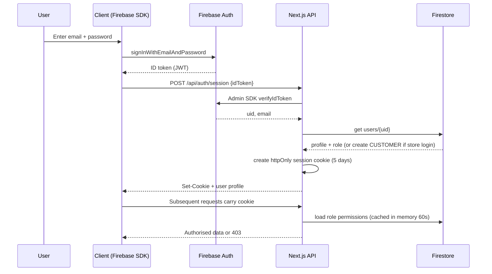

- **Customers**: email+password, Google sign-in, phone OTP optional (also usable to verify COD orders). Firestore `users/{uid}` created on first login with `role = CUSTOMER`.
- **Staff**: created only by Super Admin via invite (`/admin/users`): create Firebase user → write `users/{uid}` with role → send password-reset email. Role is stored in Firestore **and** as a Firebase custom claim; **Firestore is authoritative**.
- Admin login requires an existing staff `users/{uid}` doc with `isActive = true`; otherwise "not invited".
- Password reset: Firebase email action link.
- Session: Firebase **session cookie** (`createSessionCookie`), `httpOnly`, `secure`, `sameSite=lax`.
- First user seeded as `SUPER_ADMIN` through a one-time script using `SEED_ADMIN_EMAIL`.

## 2.5 RBAC permission matrix (✔ = full, R = read only, — = none)

| Module | Super Admin | Admin | Sales | Inventory | Accountant | HR | Content |
|---|---|---|---|---|---|---|---|
| Dashboard | ✔ | ✔ | ✔ | R | R | R | — |
| Orders | ✔ | ✔ | ✔ | R | R | — | — |
| Products/Categories | ✔ | ✔ | R | ✔ | R | — | R |
| Inventory/Stock | ✔ | ✔ | R | ✔ | R | — | — |
| Purchases/Suppliers | ✔ | ✔ | — | ✔ | ✔ | — | — |
| Invoices/Payments | ✔ | ✔ | R | — | ✔ | — | — |
| Expenses | ✔ | ✔ | — | — | ✔ | — | — |
| CRM/Leads/Customers | ✔ | ✔ | ✔ | — | R | — | — |
| Reports | ✔ | ✔ | Sales only | Stock only | Finance only | — | — |
| Careers | ✔ | ✔ | — | — | — | ✔ | — |
| CMS/Blogs/Banners | ✔ | ✔ | — | — | — | — | ✔ |
| Users & Roles | ✔ | — | — | — | — | — | — |
| Settings/Backups/Audit | ✔ | R | — | — | — | — | — |

Implementation: `roles/{role}` Firestore docs holding a `permissions` array of `module:action` strings (`orders:read`, `orders:update`, …), defaults seeded from this matrix. Helper `can(user, 'orders:update')`.

## 2.6 Key backend services (business logic)

### a) Place order & stock (COD / manual transfer) — one Firestore transaction
No payment gateway means there is **no "wait for payment webhook" step**. Stock is deducted at order placement.

`POST /api/checkout/place` → inside **one Firestore transaction** (all reads first, then writes):
1. Re-read every product from Firestore; **recompute prices, GST and totals server-side** (ignore client prices).
2. Validate stock (`stockAvailable >= qty`), pincode serviceability, COD rules, coupon validity.
3. Query batches `where productId == X and hasStock == true orderBy expiryDate asc` and deduct **FEFO** (first-expiry-first-out).
4. Update `products/{id}.stockAvailable` and `isLowStock`; append `stock_movements` (`SALE_OUT`).
5. Allocate order number from `counters/order_{FY}`.
6. Create `orders/{id}` (items embedded, status history embedded).
7. **COD →** status `CONFIRMED`, also allocate invoice number + create `invoices/{id}` in the same transaction.
   **Manual UPI/bank →** status `PENDING_PAYMENT`; invoice is created when admin confirms.
8. Upsert `customers/{id}`; increment `stats_daily/{date}` counters (see §5.8).

After commit (outside transaction): render invoice PDF → upload to Cloudinary (private) → save URL on invoice → send emails. If any post-commit step fails it is retried by cron (`invoice.pdfStatus = PENDING`).

Guard: max **40 line items per order** so a transaction stays far below Firestore's 500-write limit.

Cancel / return → reverse transaction (`RETURN_IN` movements back into the original batches, stats decremented, credit note if invoiced).
Cron `/api/cron/release-unpaid`: manual-transfer orders still `PENDING_PAYMENT` after **24 h** → auto-cancel + restore stock.

### b) Payments without a gateway
- `PaymentProvider` interface: `{ name, createPayment(order), verify(payload), refund(payment, amount) }`.
- v1 implementations: **`CodProvider`** (payment stays `PENDING` until delivery; admin/courier marks **COD collected** → `PAID`) and **`ManualProvider`** (customer pays by UPI/bank transfer to details from Settings, enters UTR/reference + optional screenshot (Cloudinary); admin verifies → `PAID`, order → `CONFIRMED`).
- Refunds are **manual**: admin records refund amount, method and reference in `refunds`; order → `REFUNDED`.
- Future: add `RazorpayProvider` (or other) + webhook route without touching order/inventory code.

### c) COD abuse controls (settings-driven)
Max COD order value, COD only for allowed pincodes, max COD orders per phone per day, optional phone OTP before COD confirmation, block list for repeat RTO phones.

### d) GST engine (`/lib/gst.ts`)
```
inputs : lines[{ unitPricePaiseInclusive|Exclusive, qty, gstRate, discount }], businessStateCode, placeOfSupplyStateCode
logic  : taxable = (price*qty - discount) [/(1+rate) if tax-inclusive]
         gst = taxable * rate
         if business==supply → cgst=sgst=gst/2 ; else igst=gst
         round each line to paise; invoice total rounded to nearest rupee with round-off line
output : per-line + totals + HSN summary
```
Retail store prices are **GST-inclusive**; the engine back-calculates.

### e) Invoice & document numbering
`counters/{key}` documents (e.g. `invoice_26-27`, `order_26-27`, `po_26-27`, `credit_26-27`) incremented **inside the transaction** (`last + 1`) → `EBPL/26-27/0001`. Financial year rolls on 1 April. No gaps because the counter and the document are written atomically.

### f) Low-stock alerts
Every product keeps denormalised `stockAvailable` and boolean `isLowStock` (= `trackInventory && stockAvailable <= reorderLevel`), updated in the same transaction that changes stock. Cron every 6 h queries `isLowStock == true`, creates `alerts` docs (if none open), emails Inventory/Admin, shows a dashboard badge. Reorder suggestion = `maxLevel − stockAvailable`. Expiry alerts: batches expiring ≤ 60 days.

### g) Reports (Weekly / Monthly / Yearly) — Firestore has no joins/group-by
Use **pre-aggregated daily statistics**: every order, cancellation, return, expense and invoice updates `stats_daily/{YYYY-MM-DD}` with `FieldValue.increment()` in the same transaction. A report = read the date range (week ≤ 7 docs, month ≤ 31, year ≤ 366), sum on the server, cache 5 min. Week = Monday–Sunday, **IST (Asia/Kolkata)**. Detailed lists (e.g. invoices for GST filing) use ranged queries on indexed date fields. Full data model in §5.8.

### h) Backups (Firestore)
- Enable **Point-in-Time Recovery** (7-day) on the Firestore database.
- Nightly Vercel Cron calls the Firestore **`exportDocuments`** API (service account with `datastore.importExportAdmin`) → `gs://<project>-backups/YYYY-MM-DD/`.
- GCS **lifecycle rules**: keep 30 daily exports, then 12 monthly (first of month).
- Each run writes a `backup_logs` doc (status, path, started/finished). Admin page lists them and has **"Run backup now"**.
- Restore (documented in runbook): `gcloud firestore import gs://…` into a new/empty database, then switch `FIREBASE` project/database id; test quarterly.
- Cloudinary media is durable on its own; a weekly job writes a manifest of `public_id`s to the same bucket.

## 2.7 API surface (REST, JSON, all `/api/*`)

| Group | Endpoints |
|---|---|
| Auth | `POST /auth/session`, `POST /auth/logout`, `GET /auth/me` |
| Catalog (public) | `GET /products`, `GET /products/:handle`, `GET /collections`, `GET /search`, `GET /pincode/:pin` |
| Cart/Checkout | `POST /cart/sync`, `POST /checkout/place` (`method: COD \| MANUAL`), `POST /checkout/:orderNo/payment-proof` (UTR + screenshot) |
| Orders (customer) | `GET /orders`, `GET /orders/:id`, `POST /track-order`, `POST /orders/:id/cancel`, `POST /orders/:id/return` |
| Reviews | `POST /reviews`, `GET /products/:id/reviews` |
| Careers (public) | `GET /jobs`, `GET /jobs/:slug`, `POST /jobs/:slug/apply` |
| Contact | `POST /contact`, `POST /newsletter` |
| Uploads | `POST /uploads/sign` (Cloudinary signature; staff, verified buyer, or applicant with Turnstile) |
| Admin CRUD | `/admin/api/{products,categories,inventory,stock-movements,purchase-orders,grn,suppliers,customers,leads,orders,invoices,credit-notes,payments,refunds,expenses,jobs,applications,banners,pages,blogs,testimonials,users,settings}` |
| Admin order actions | `POST /admin/api/orders/:id/(confirm-payment \| mark-cod-collected \| pack \| ship \| deliver \| cancel \| refund)` |
| Reports | `GET /admin/api/reports/:type?range=week\|month\|year\|custom&from&to&format=json\|csv\|xlsx\|pdf` |
| Ops | `GET /admin/api/audit-logs`, `POST /admin/api/backups/run`, `GET /admin/api/backups` |
| Cron (secured by `CRON_SECRET`) | `/api/cron/low-stock`, `/api/cron/backup`, `/api/cron/recurring-expenses`, `/api/cron/release-unpaid`, `/api/cron/retry-invoice-pdf` |

Conventions: cursor-based pagination `?limit&cursor` (Firestore `startAfter`), errors `{ error: { code, message, fields? } }`, idempotency key on `POST /checkout/place` (prevents double orders on double-click).

## 2.8 Cloudinary usage
- Folders: `eb/products`, `eb/banners`, `eb/blogs`, `eb/reviews`, `eb/cv` (type `authenticated`/raw, **private**), `eb/invoices` (private), `eb/payment-proofs` (private), `eb/branding`.
- Upload flow: client requests signature → direct upload → store `public_id`, `secure_url`, `width`, `height`, `format`, `bytes` in `media_assets`.
- Delivery: `next-cloudinary`/`f_auto,q_auto,w_*` transformations; responsive `srcset`.
- CVs and invoice PDFs are **private**; admin downloads via short-lived signed URLs.
- Limits: images ≤ 5 MB, video ≤ 50 MB, CV (PDF/DOCX) ≤ 5 MB.

## 2.9 Security checklist
HTTPS only + HSTS · CSP headers · **Firestore Security Rules = deny all client access (server/Admin SDK only)** · optional Firebase App Check · rate limit login/checkout/apply/contact · Zod validation on every API · output escaping · file-type & size checks (server-side) · idempotency key on order placement · server-side price/stock/GST recomputation · bot protection (Cloudflare Turnstile/hCaptcha) on forms · COD abuse controls (§2.6-c) · admin audit log · least-privilege roles · secrets in env only · dependency audit in CI · cookie consent banner · data-deletion workflow (DPDP) · no card or bank-login data ever stored.

## 2.10 Environment variables
```
NEXT_PUBLIC_FIREBASE_API_KEY= NEXT_PUBLIC_FIREBASE_AUTH_DOMAIN= NEXT_PUBLIC_FIREBASE_PROJECT_ID= NEXT_PUBLIC_FIREBASE_APP_ID=
FIREBASE_ADMIN_PROJECT_ID= FIREBASE_ADMIN_CLIENT_EMAIL= FIREBASE_ADMIN_PRIVATE_KEY=
FIRESTORE_DATABASE_ID=(default)
CLOUDINARY_CLOUD_NAME= CLOUDINARY_API_KEY= CLOUDINARY_API_SECRET= NEXT_PUBLIC_CLOUDINARY_CLOUD_NAME=
RESEND_API_KEY= EMAIL_FROM=
UPSTASH_REDIS_REST_URL= UPSTASH_REDIS_REST_TOKEN=            # optional
BACKUP_BUCKET=gs://<project>-backups
CRON_SECRET= SEED_ADMIN_EMAIL= NEXT_PUBLIC_SITE_URL= NEXT_PUBLIC_WHATSAPP_NUMBER=
SENTRY_DSN=
# Later (not needed in v1): SHIPROCKET_EMAIL, SHIPROCKET_PASSWORD, payment-gateway keys
```

## 2.11 Repository structure
```
/app
  /(corporate)/…         /(store)/shop/…         /(admin)/admin/…
  /api/…
/components  /ui (shadcn)  /corporate  /store  /admin  /shared
/lib
  firebase-admin.ts  firestore.ts  converters.ts  auth.ts  rbac.ts
  gst.ts  invoice.ts  inventory.ts  orders.ts  stats.ts  reports.ts
  payments/  (provider.ts  cod.ts  manual.ts)
  cloudinary.ts  email.ts  backup.ts
/emails  (React Email templates)
/scripts  seed.ts  create-super-admin.ts
/tests  unit/  e2e/  (use Firebase Emulator Suite)
firebase.json  firestore.rules  firestore.indexes.json
/docs  PRD.md TRD.md DECISIONS.md RUNBOOK.md
```

---

# 3. APP FLOW

## 3.1 Sitemap

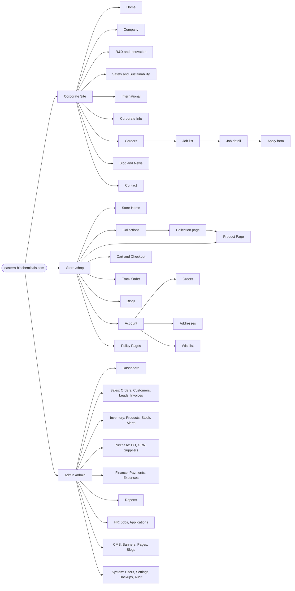

## 3.2 THE KEY FLOW — "Shop" button opens the dedicated store

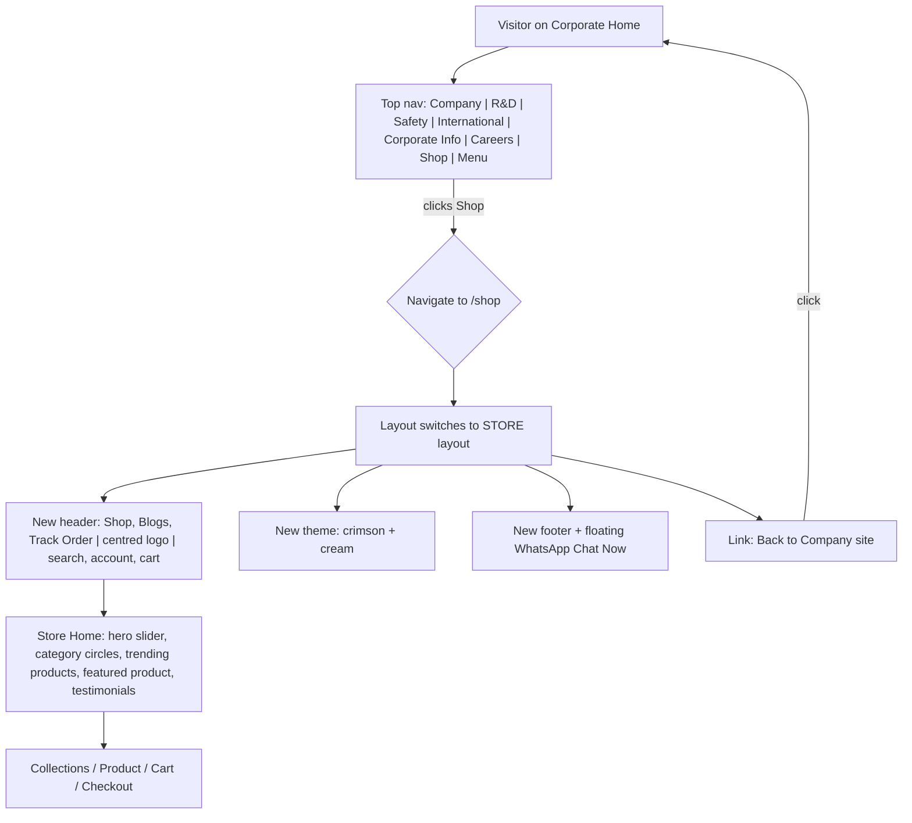

Implementation note: `app/(store)/shop/layout.tsx` renders its own `<StoreHeader/>`, `<StoreFooter/>`, theme class `theme-store`; `app/(corporate)/layout.tsx` renders `<CorpHeader/>` with the Shop button pointing to `/shop`. The two layouts **must not share the header component**.

## 3.3 Customer purchase flow (COD + optional manual transfer — no online gateway)

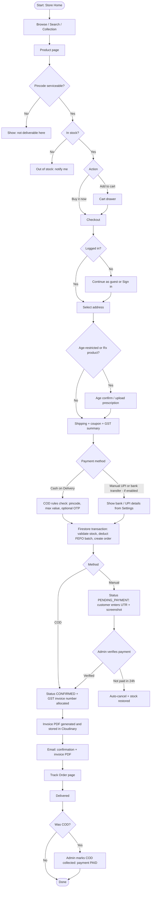

> **Future-proofing:** `PaymentProvider` interface (§2.6-b) means a gateway such as Razorpay can later be added as a third option at the "Payment method" step without changing order, stock or invoice logic.

## 3.4 Order lifecycle (state machine)

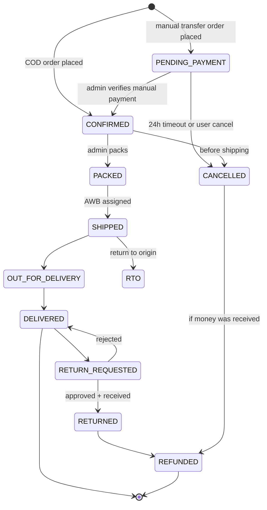

## 3.5 Authentication & role routing

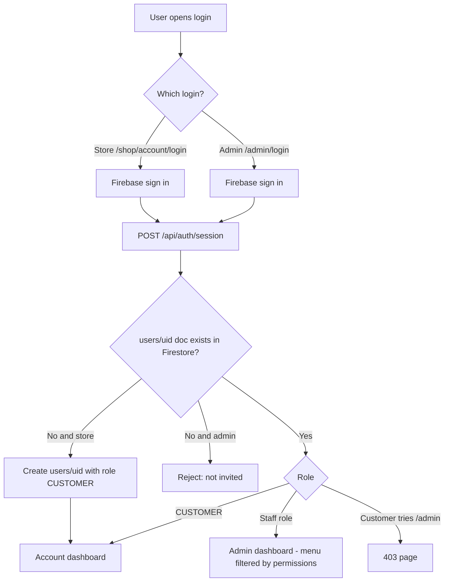

## 3.6 Careers flow

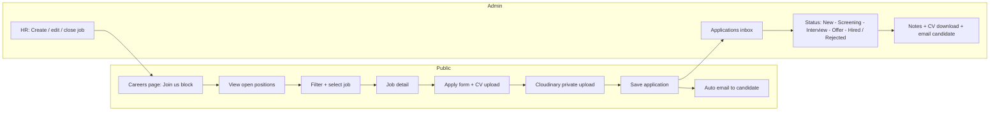

## 3.7 Inventory ⇄ Purchase ⇄ Sales loop

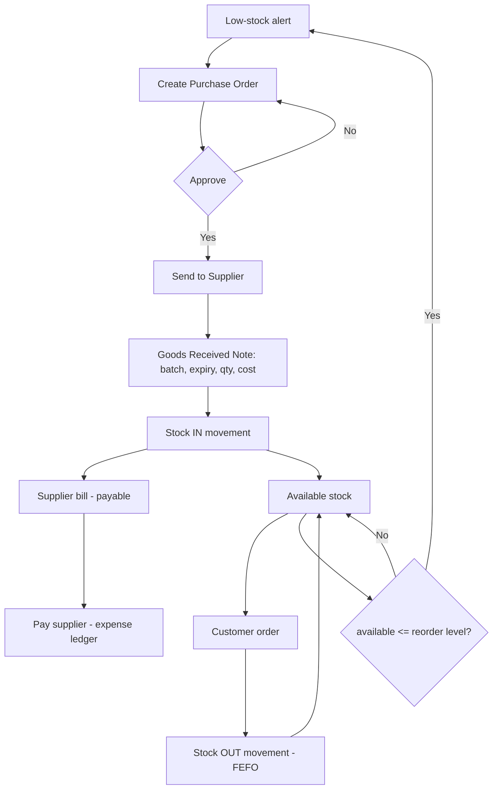

## 3.8 GST invoice flow

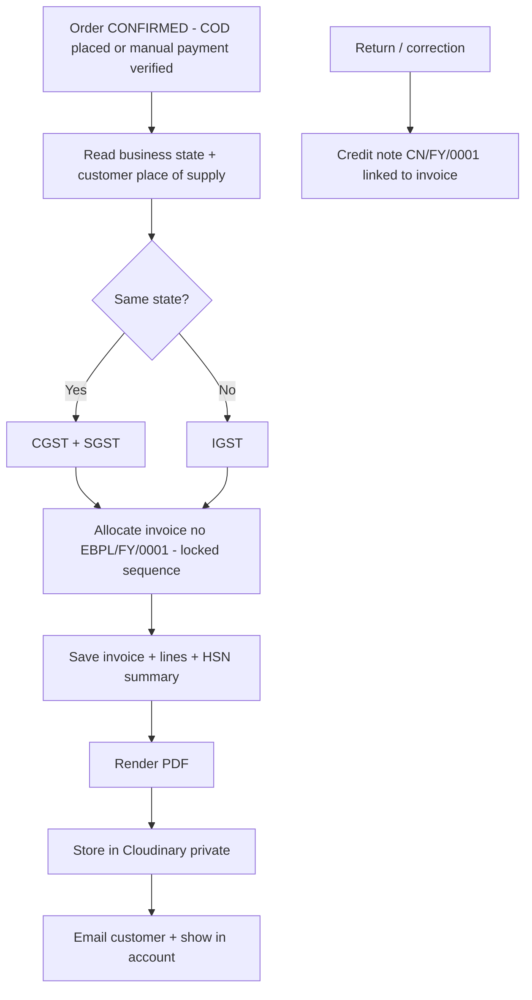

## 3.9 Admin daily workflow overview

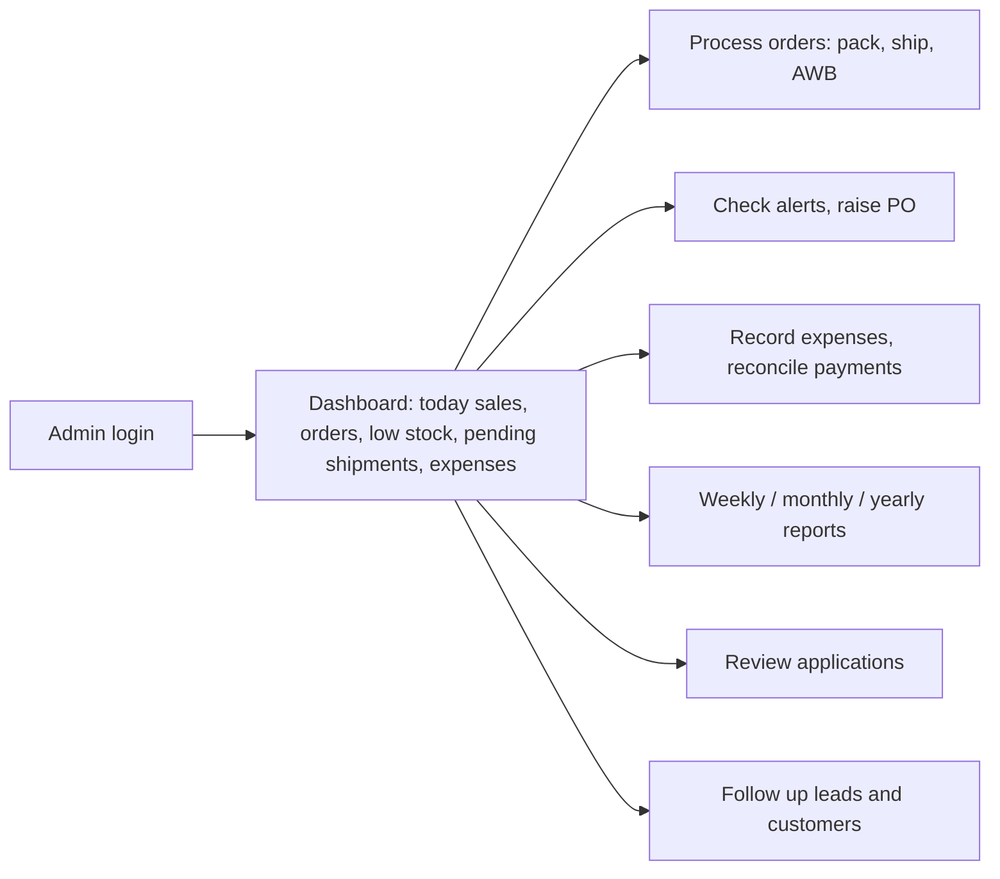

---

# 4. UI/UX BRIEF

## 4.1 Design principle
Two **distinct visual identities** in one product:
1. **Corporate site** — clean, scientific, trustworthy (white + deep blue→purple gradients, large photography, big bold headlines). Matches the *company profile reference* (Mankind-style layout).
2. **Store** — warm, shoppable, high-energy (cream background, crimson accent, rounded cards, discount badges). Matches the *e-commerce reference* (Epic-style layout).
3. **Admin** — neutral, dense, data-first dashboard (sidebar + tables + charts).

> Replicate **layout, spacing, structure and interaction patterns** — not logos, images, wording, or trademarks (see A14).

## 4.2 Design tokens

### Corporate theme
| Token | Value |
|---|---|
| `--c-primary` | `#0A1B8F` (deep blue) |
| `--c-gradient` | `linear-gradient(120deg,#0A1B8F 0%,#6B1FA0 100%)` |
| `--c-accent` | `#1AA3D9` (sky blue, small eyebrow labels) |
| `--c-bg-soft` | `#EEF2F8` |
| `--c-text` | `#0B0B0F` / secondary `#4B5563` |
| Footer | `#1C1C1C` text `#9CA3AF`, bottom bar `#000` |
| Font | **Inter** (700/800 headings, 400/500 body) |
| Headline | H1 56–72 px bold, tight tracking; eyebrow 13 px uppercase accent |
| Radius | cards 12 px, buttons pill (999 px) |
| Container | max-width 1200 px, 24 px gutters |

### Store theme
| Token | Value |
|---|---|
| `--s-primary` | `#E01B47` (crimson) · hover `#C4153C` |
| `--s-bg` | `#FFF9F7` (cream) · card `#FFFFFF` |
| `--s-text` | `#141414` |
| `--s-badge` | `#E01B47` bg, white text (e.g. "Save 24%") |
| `--s-success` | `#16A34A` on `#ECFDF3` (In stock pill) |
| `--s-star` | `#F59E0B` |
| `--s-whatsapp` | `#25D366` |
| Font | **Inter** headings extra-bold, tight; body 400 |
| Radius | cards 16 px, buttons pill, inputs 8 px |
| Shadow | `0 2px 8px rgba(0,0,0,.08)` |

### Admin theme
Slate neutrals (`#0F172A` sidebar, `#F8FAFC` canvas), primary = corporate blue `#0A1B8F`, status colours (green/amber/red), 14 px base font, tables with sticky headers.

## 4.3 Corporate site layouts

### Header (desktop)
```
┌────────────────────────────────────────────────────────────────────────────┐
│ [Announcement bar – brand blue – editable text + "Learn More" link]         │
├────────────────────────────────────────────────────────────────────────────┤
│ [LOGO]  Company  R&D & Innovation  Safety & Sustainability  International   │
│         Corporate Info  Careers                         [ Shop ]   [☰]      │
└────────────────────────────────────────────────────────────────────────────┘
```
- Sticky, white, 76 px high. **Shop** is a text-link styled slightly bolder; on click → `/shop`.
- ☰ opens full-screen menu (all pages + contact + social).
- Mobile: logo left, Shop + ☰ right.

### Home page sections (top → bottom)
```
1. HERO (100vh)       – full-bleed looping video/image, dark-blue overlay, centred H1
                        "Advancing Healthcare and Better Science for a Healthier India"
                        scroll cue (circle ↓ + "SCROLL")
2. INTRO STATEMENT    – centred 1–2 line statement + [LEARN MORE] pill button
3. R&D & INNOVATION   – eyebrow "R&D & INNOVATION", H2 "We seek out, and solve, tough challenges."
                        3-column cards: [stat card] [stat card] [image + gradient highlight card]
                        certification roundel top-right (e.g. ISO badge — only if actually certified)
4. INNOVATING FOR THE WORLD – full-width photo with floating translucent text card on right
5. OUR PROMISE        – eyebrow, H2 "Leave no citizen behind…", 3 cards: Quality | Affordability | Accessibility (icon in blue circle)
6. BUSINESS VERTICALS – left: H2 + paragraph; right/below: staggered icon cards (zig-zag layout)
                        over a soft molecular-image background
7. SUSTAINABILITY SPOTLIGHT – H2 + prev/next arrows; horizontal carousel of image cards with tag + title + date
8. ESG / REPORT BANNER – blue→purple gradient bar, H3 + white pill button "DOWNLOAD REPORT"
9. CAREERS CTA        – white card, 2 columns: text + 3 tick bullets + [VIEW OPEN POSITIONS] | photo
10. LATEST UPDATES    – audio/news strip + document download tiles (gradient cards: Annual Report etc.)
11. FOOTER            – dark, 4 columns: Contact Information | Corporate Office | Quick Links | Logo + [GET IN TOUCH] + socials
                        legal row (Code of Conduct, Privacy, Disclaimer…) · bottom bar "© 2026 Eastern Biochemicals Pvt Ltd. All rights reserved."
```
Interactions: fade/slide-up on scroll (200–400 ms), count-up numbers, carousel swipe, hover lift on cards (translateY −4 px).

### Careers page
Hero → filter bar (department, location, type) → job cards (title, location, type, posted date, [Apply]) → job detail (responsibilities, requirements, benefits) → application form (name, email, phone, current company, experience, CV upload, cover note, consent checkbox) → success state.

## 4.4 Store layouts

### Store header (distinct from corporate)
```
┌────────────────────────────────────────────────────────────────────────────┐
│ [Promo bar – crimson – editable]                                            │
├────────────────────────────────────────────────────────────────────────────┤
│  Shop   Blogs   Track Order          [  BRAND LOGO  ]          🔍  👤  🛍(n) │
└────────────────────────────────────────────────────────────────────────────┘
```
Left links in crimson, logo centred, icons right. Sticky. Cart icon opens a slide-in drawer.

### Store home sections
```
1. HERO SLIDER       – rounded 20 px banners, arrows + dots, editable from admin (Cloudinary)
2. "ZONE" SECTION    – H2 + tagline; 3 circular category images (soft-pink circle bg) with title + subtitle
3. TRENDING PRODUCTS – H2 + category pill filter chips; 3–4 col product grid (cards below)
4. STORY BANNER      – before/after slider or split banner explaining a hero product benefit
5. FEATURED PRODUCT  – rotating-text circular badge "FEATURED PRODUCT", gallery thumbs (vertical) + big image,
                        brand name, title, price/MRP, rating, stock pill, [Add to cart], share icons, "Need help?", "View full details →"
6. LIFESTYLE VIDEO   – autoplay muted rounded video with pause button
7. TESTIMONIALS      – full-bleed dark photo, big quote, author, 3 dots
8. FOOTER            – crimson-brown bar: © + Privacy · Legal Notice · Terms · Delivery & Returns · Warranty · Support Ticket
+ Floating green "Chat Now" WhatsApp button (bottom-right, all pages)
```

### Product card
```
┌───────────────────────────┐
│ [Save 24%]        ★ 3.5   │  ← badge top-left, rating chip top-right
│        (product image)    │  ← white/grey bg, object-contain, 1:1
│                           │
│  Product name (2 lines)   │
│  ₹300.00  ~~₹396.00~~     │  ← crimson price + struck MRP
└───────────────────────────┘
hover: soft shadow + quick "Add to cart" button; out-of-stock: grey overlay "Sold out"
```
Discount % = `round((mrp − price) / mrp × 100)`.

### Collections page
H1 "Collections"; grid 3 cols (desktop) / 2 (tablet) / 1–2 (mobile) of large rounded cards: image with dark overlay, white bold title bottom-left with **product-count superscript** (e.g. "Shop All ⁵⁰"). First card = "Shop All".

### Product detail page
Left: vertical thumbnails + main image with arrows. Right: title (H1), rating + review count (anchor to reviews), price + MRP, green pill "In stock, ready to ship", qty stepper `[− 1 +]` + **Add to cart** (crimson, full width) + **Buy it now** (outline), pincode input + Check, trust accordions (Description, How to use, Ingredients/Specs, Shipping & returns). Below: **Customer Reviews** (average, 5-bar distribution, "Write a review", customer photos strip, sort, list) → **You may also like** carousel → **sticky mini add-to-cart bar** (thumb + name + price + button) appears after scrolling past the main button.

### Track Order page
Centred H1 "Track Order"; fields: Order Number, Phone Number or Email; pill button "Track Order"; result = vertical timeline (Confirmed → Packed → Shipped → Out for delivery → Delivered) with AWB + courier link.

### Login page
Centred H1 "Login"; Email, Password, "Forgot password?"; two buttons side by side: **Sign in** (filled) and **Create account** (outline); "← Return to Store" link; Google sign-in button.

### Blogs page
Hero title with hashtag-style tagline, category chips (All + admin categories), 3-up featured cards, red full-width banner strip, then 2-column list cards (thumb left, title, outlined **KNOW MORE →** button).

### Content sensitivity
Because wellness-category imagery can be sensitive, store imagery must be **tasteful and non-explicit**, and the age-gate (if enabled) must appear before such collections. Blog copy follows medical-accuracy review.

## 4.5 Admin layouts

```
┌──────────┬───────────────────────────────────────────────────────────┐
│ SIDEBAR  │ Top bar: breadcrumb · global search · alerts 🔔 · profile   │
│ Dashboard├───────────────────────────────────────────────────────────┤
│ Orders   │ KPI cards: Today Sales | Orders | AOV | Low-stock | Expenses│
│ Products │ ┌──────────── Sales trend (Week/Month/Year toggle) ───────┐ │
│ Inventory│ │  line/bar chart                                          │ │
│ Purchases│ └──────────────────────────────────────────────────────────┘ │
│ Suppliers│ ┌ Top products ┐ ┌ Low-stock list ┐ ┌ Recent orders ┐       │
│ CRM      │ └──────────────┘ └────────────────┘ └───────────────┘       │
│ Invoices │                                                              │
│ Expenses │ Standard list page = filters bar + data table + bulk actions │
│ Reports  │ + right-side drawer for create/edit (no full page reloads)   │
│ Careers  │                                                              │
│ CMS      │ Detail page = header (status chip, actions) + tabs           │
│ Users    │                                                              │
│ Settings │ Mobile: collapsible sidebar, tables → stacked cards          │
└──────────┴───────────────────────────────────────────────────────────┘
```
Required admin components: DataTable (sort/filter/paginate/export), StatusBadge, DateRangePicker (presets: This week, This month, This year, Custom), KPI card, Chart card, ConfirmDialog, FormDrawer, ImageUploader (Cloudinary), RichTextEditor (TipTap), PermissionGate.

## 4.6 Component inventory (shared)
Button (primary/outline/ghost/pill), Input, Select, Checkbox, Modal, Drawer, Toast, Skeleton loaders, Badge, Tabs, Accordion, Carousel, Rating stars, Quantity stepper, Breadcrumb, Pagination, EmptyState, ErrorState, Cookie banner, AgeGate modal.

## 4.7 Responsive & accessibility
Breakpoints: 360 / 768 / 1024 / 1280 px. Tap targets ≥ 44 px. Contrast ≥ 4.5:1 (check crimson on cream, white on gradient). `alt` text mandatory for all images; focus rings visible; reduce-motion respected; forms have labels and inline errors; video has pause control.

## 4.8 Content & SEO
Per page: title ≤ 60 chars, meta description ≤ 160, OG image, canonical, JSON-LD (`Organization`, `Product`, `BreadcrumbList`, `JobPosting`, `Article`), XML sitemap, robots.txt, human-readable slugs.

---

# 5. BACKEND SCHEMA (Firebase Firestore + Cloudinary)

Firestore is a **NoSQL document database**: no joins, no SQL, no GROUP BY. This schema is therefore designed around **how data is read** — with embedding, denormalised counters and pre-aggregated statistics.

## 5.1 Data-model overview

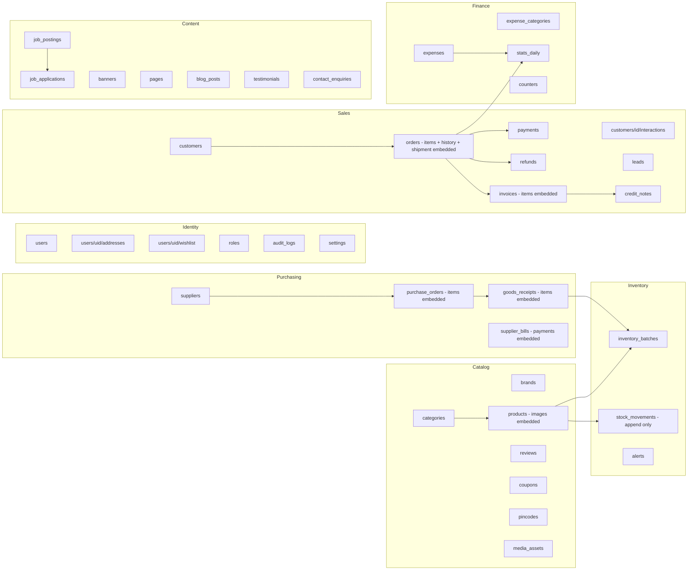

## 5.2 Conventions
- **Naming:** collections `snake_case`, fields `camelCase`. Document IDs: `users/{firebaseUid}`; others Firestore auto-ID unless noted.
- **Money:** integers in **paise** (₹499.00 → `49900`). **Dates:** Firestore `Timestamp` (UTC); display and bucket in **IST**. Date keys for stats = `YYYY-MM-DD` in IST.
- **Every document:** `createdAt`, `updatedAt`, (`createdBy` where staff-created).
- **Embed vs separate collection:** embed data that is always read with the parent and bounded in size (order items, invoice items, PO items, product images). Use separate collections for unbounded or independently queried data (orders, stock_movements, reviews, expenses).
- **Denormalise on purpose:** order items store `nameSnapshot`, `skuSnapshot`, `hsn`, `gstRate`, prices (history must not change when a product is edited). Products store `stockAvailable`, `isLowStock`, `ratingAvg`, `ratingCount`. Categories store `productCount`.
- **Soft delete:** `deletedAt` on products, customers, suppliers, posts. Never delete orders, invoices, stock movements, payments, expenses.
- **Non-expiring batches:** set `expiryDate` to a sentinel `2999-12-31` so FEFO ordering works (documents missing the field are excluded from `orderBy`).
- **Search:** no full-text in Firestore → store `searchKeywords: string[]` (lower-cased name tokens + prefixes, SKU) and use `array-contains` / prefix range queries. (Algolia/Typesense can be added later if needed.)
- **Size limits to respect:** document ≤ 1 MB; transaction ≤ 500 writes; sustained writes ≈ 1/second per document (fine for `stats_daily` at this scale).
- **Access:** server-only via Admin SDK; client rules deny all (§5.6).

## 5.3 Constants / enums (TypeScript `as const` in `/lib/constants.ts`)
```
Role            SUPER_ADMIN | ADMIN | SALES | INVENTORY | ACCOUNTANT | HR | CONTENT | CUSTOMER
OrderStatus     PENDING_PAYMENT | CONFIRMED | PACKED | SHIPPED | OUT_FOR_DELIVERY | DELIVERED | CANCELLED | RTO | RETURN_REQUESTED | RETURNED | REFUNDED
PaymentStatus   PENDING | PAID | FAILED | REFUNDED | PARTIAL_REFUND
PaymentMethod   COD | MANUAL_UPI | MANUAL_BANK | CASH | (future: GATEWAY)
MovementType    PURCHASE_IN | SALE_OUT | RETURN_IN | ADJUSTMENT_IN | ADJUSTMENT_OUT | DAMAGE | EXPIRED | TRANSFER
POStatus        DRAFT | PENDING_APPROVAL | APPROVED | SENT | PARTIALLY_RECEIVED | RECEIVED | CANCELLED
ApplicationStatus  NEW | SCREENING | INTERVIEW | OFFERED | HIRED | REJECTED
LeadStatus      NEW | CONTACTED | QUALIFIED | PROPOSAL | WON | LOST
PublishStatus   DRAFT | PUBLISHED | ARCHIVED
ExpenseFreq     ONE_TIME | WEEKLY | MONTHLY | YEARLY
```

## 5.4 Collections and fields

### Identity & access
| Collection (path) | Fields | Notes |
|---|---|---|
| `users/{uid}` | email, phone, fullName, role, isActive, lastLoginAt, avatar{publicId,url} | uid = Firebase UID |
| `users/{uid}/addresses/{id}` | name, phone, line1, line2, city, state, stateCode, pincode, country, isDefault, gstin? | |
| `users/{uid}/wishlist/{productId}` | addedAt | |
| `carts/{uidOrSessionId}` | items[{productId, qty}], couponCode?, updatedAt | server-side cart for logged-in users; guests use localStorage then merge |
| `roles/{role}` | permissions: string[] (e.g. `orders:update`) | seeded from §2.5; editable by Super Admin |
| `audit_logs/{id}` | userId, userEmail, action, entity, entityId, before, after, ip, userAgent, createdAt | write-only from server |
| `settings/{group}` | `general` (company name, CIN, logo), `gst` (GSTIN, stateCode, address), `invoice` (prefix EBPL, terms, bank details), `store` (COD on/off, COD max value, manual transfer on/off, UPI id, shipping rules, free-shipping threshold), `alerts` (defaults), `social` | one doc per group |

### Catalog
| Collection | Fields |
|---|---|
| `categories/{id}` | name, slug, parentId?, image{publicId,url}, sort, isActive, productCount |
| `brands/{id}` | name, slug, logo? |
| `products/{id}` | sku, name, slug, categoryId, categoryName (denorm), brandId?, shortDesc, description (rich), howToUse, specs (map), mrpPaise, pricePaise, gstRate (0/5/12/18/28), hsnCode, unit, weightG, barcode?, trackInventory, reorderLevel, maxLevel, **stockAvailable**, **isLowStock**, requiresPrescription, ageRestricted18Plus, isFeatured, isTrending, status (PublishStatus), images[{publicId,url,alt,sort,isPrimary}], searchKeywords[], ratingAvg, ratingCount, seoTitle, seoDesc, deletedAt? |
| `reviews/{id}` | productId, userId, orderId (verified buyer), rating 1–5, title, body, status (PENDING/APPROVED/REJECTED), photos[{publicId,url}] |
| `coupons/{CODE}` | type (PERCENT/FLAT), value, minOrderPaise, maxDiscountPaise, startsAt, endsAt, usageLimit, usedCount, isActive | doc ID = code |
| `pincodes/{pincode}` | city, state, stateCode, isServiceable, codAvailable, etaDays |
| `media_assets/{id}` | publicId, secureUrl, resourceType, format, width, height, bytes, folder, isPrivate, uploadedBy |

### Inventory
| Collection | Fields | Notes |
|---|---|---|
| `inventory_batches/{id}` | productId, batchNo, mfgDate?, expiryDate (or sentinel), qtyOnHand, **hasStock** (qtyOnHand > 0), costPaise, grnId?, warehouseId | FEFO query: `productId == X, hasStock == true, orderBy expiryDate` |
| `stock_movements/{id}` | productId, batchId?, type, qty (+in / −out), refType (ORDER/GRN/ADJUSTMENT), refId, note, createdBy, createdAt | **append-only ledger** |
| `alerts/{id}` | type (LOW_STOCK/EXPIRY/ORDER), productId?, message, status (OPEN/ACK/RESOLVED), createdAt | |

`products.stockAvailable` = Σ `qtyOnHand` of that product's batches, **always updated in the same transaction** as batch/movement writes.

### Purchasing & suppliers
| Collection | Fields |
|---|---|
| `suppliers/{id}` | name, contactPerson, email, phone, gstin, pan, address, stateCode, paymentTermsDays, bank{…}, rating, isActive, deletedAt? |
| `purchase_orders/{id}` | poNo, supplierId, supplierName, status, orderDate, expectedDate, items[{productId, name, qtyOrdered, qtyReceived, unitCostPaise, gstRate}], subtotal, gstTotal, total, notes, createdBy, approvedBy? |
| `goods_receipts/{id}` | grnNo, poId, receivedDate, receivedBy, items[{productId, batchNo, mfgDate, expiryDate, qty, costPaise}], notes — creating a GRN **creates batches + PURCHASE_IN movements + updates stock in one transaction** |
| `supplier_bills/{id}` | supplierId, poId?, billNo, billDate, dueDate, amount, paidAmount, status (UNPAID/PARTIAL/PAID), attachment{publicId,url}, payments[{amount, method, refNo, paidOn}] |

### Sales, billing & finance
| Collection | Fields |
|---|---|
| `customers/{id}` | userId?, name, email, phone, gstin?, type (RETAIL/B2B), tags[], totalSpentPaise, ordersCount, lastOrderAt, marketingOptIn, source, notes |
| `customers/{id}/interactions/{id}` | type (CALL/EMAIL/WHATSAPP/NOTE), summary, byUser, at |
| `leads/{id}` | name, email, phone, company, source, status, assignedTo, notes, nextFollowupAt |
| `orders/{id}` | orderNo (`EB-100245`), customerId, userId?, status, paymentStatus, paymentMethod, shippingAddress{}, billingAddress{}, placeOfSupplyStateCode, **items[{productId, nameSnapshot, skuSnapshot, hsn, qty, unitPricePaise, mrpPaise, gstRate, taxableValue, cgst, sgst, igst, lineTotal, batchAllocations[{batchId, qty}]}]**, subtotal, discountTotal, shippingFee, taxTotal, grandTotal, couponCode?, **statusHistory[{status, note, by, at}]**, **shipment{courier, awb, trackingUrl, shippedAt, deliveredAt}**, paymentProof{utr, screenshot{publicId,url}}?, codCollectedAt?, invoiceId?, channel (WEB/ADMIN), placedAt, dateKey (IST YYYY-MM-DD) |
| `payments/{id}` | orderId, method, status, amount, reference (UTR), recordedBy, paidAt — ledger for reconciliation |
| `refunds/{id}` | orderId, paymentId?, amount, method, reference, reason, recordedBy, at |
| `invoices/{id}` | invoiceNo (unique), fy, orderId?, customerId, issueDate, buyerName, buyerGstin?, billingAddress{}, placeOfSupply, supplyType (INTRA/INTER), items[{description, hsn, qty, unit, rate, discount, taxable, gstRate, cgst, sgst, igst, total}], taxableTotal, cgstTotal, sgstTotal, igstTotal, roundOff, grandTotal, pdf{publicId,url}?, pdfStatus (PENDING/DONE), status (ISSUED/CANCELLED), dateKey |
| `credit_notes/{id}` | cnNo, invoiceId, reason, items[], totals…, issueDate, pdf{} |
| `counters/{key}` | last (int) — keys like `invoice_26-27`, `order_26-27`, `po_26-27`, `grn_26-27`, `credit_26-27` |
| `expense_categories/{id}` | name (Rent, Salaries, Logistics, Marketing, Utilities, Packaging, Misc…) |
| `expenses/{id}` | categoryId, categoryName, title, amountPaise, gstPaise, paidOn (Timestamp), dateKey, weekKey (`2026-W40`), monthKey (`2026-10`), paymentMethod, vendor, frequency, recurringUntil?, receipt{publicId,url}?, notes, createdBy |

### Careers
| Collection | Fields |
|---|---|
| `job_postings/{id}` | title, slug, department, location, employmentType, experienceRange, salaryRange?, description (rich), requirements, benefits, status, postedAt, closesAt, openingsCount |
| `job_applications/{id}` | jobId, jobTitle, name, email, phone, currentCompany?, experienceYears, cv{publicId, resourceType:"raw", isPrivate:true}, coverNote, links[], status, rating?, notes[], assignedTo?, appliedAt |

### Content / CMS / system
| Collection | Fields |
|---|---|
| `banners/{id}` | placement (CORP_HERO / STORE_HERO / PROMO_BAR…), title, subtitle, media{publicId,url,type}, linkUrl, sort, startsAt, endsAt, isActive |
| `pages/{id}` | scope (CORP/STORE), slug, title, blocks[] (json), seo{}, status |
| `blog_posts/{id}` | scope, title, slug, excerpt, body (rich), cover{}, category, author, status, publishedAt, seo{} |
| `testimonials/{id}` | name, quote, media?, productId?, isActive |
| `contact_enquiries/{id}` | name, email, phone, subject, message, source, status (NEW/REPLIED), createdAt |
| `newsletter_subscribers/{emailHash}` | email, createdAt |
| `backup_logs/{id}` | type (AUTO/MANUAL), status, path, startedAt, finishedAt, error |
| `notifications/{id}` | userId, title, body, link, readAt |
| `consents/{id}` | userId?/email, type (COOKIE/MARKETING/PRIVACY), version, at |
| `stats_daily/{YYYY-MM-DD}` | see §5.8 |

## 5.5 Composite indexes (`firestore.indexes.json`)
| Collection | Fields (in order) | Used for |
|---|---|---|
| products | status ASC, categoryId ASC, createdAt DESC | collection page |
| products | status ASC, isFeatured ASC, createdAt DESC | home featured/trending |
| products | trackInventory ASC, isLowStock ASC | low-stock list |
| products | status ASC, searchKeywords ARRAY, pricePaise ASC | search + sort |
| inventory_batches | productId ASC, hasStock ASC, expiryDate ASC | **FEFO deduction** |
| stock_movements | productId ASC, createdAt DESC | stock history |
| orders | customerId ASC, placedAt DESC | my orders |
| orders | status ASC, placedAt DESC | admin order queues |
| orders | orderNo ASC (single-field, automatic) | track order |
| invoices | fy ASC, issueDate DESC | GST listing |
| expenses | dateKey ASC / categoryId ASC, paidOn DESC | weekly/monthly views |
| reviews | productId ASC, status ASC, createdAt DESC | product reviews |
| job_applications | jobId ASC, status ASC, appliedAt DESC | pipeline |
| blog_posts | scope ASC, status ASC, publishedAt DESC | blogs |
| alerts | status ASC, createdAt DESC | alerts panel |
The agent must add an index whenever Firestore throws a "requires an index" error and commit the updated `firestore.indexes.json`.

## 5.6 Security rules (`firestore.rules`)
```
rules_version = '2';
service cloud.firestore {
  match /databases/{database}/documents {
    // All access is via the Next.js server using the Admin SDK (which bypasses rules).
    match /{document=**} {
      allow read, write: if false;
    }
  }
}
```
Authorisation is enforced in server code: session cookie → `users/{uid}` → role → permission (§2.5).

## 5.7 Critical transactions (reference pseudo-code)
```ts
// lib/orders.ts — placeOrder (Admin SDK)
await db.runTransaction(async (tx) => {
  // ---- READS FIRST ----
  const products = await Promise.all(items.map(i => tx.get(db.doc(`products/${i.productId}`))));
  const batchSnaps = await Promise.all(items.map(i =>
    tx.get(db.collection('inventory_batches')
      .where('productId','==',i.productId).where('hasStock','==',true)
      .orderBy('expiryDate').limit(10))));
  const orderCounter   = await tx.get(db.doc(`counters/order_${fy}`));
  const invoiceCounter = method === 'COD' ? await tx.get(db.doc(`counters/invoice_${fy}`)) : null;

  // ---- COMPUTE (server-side prices, GST, FEFO allocation) ----
  const calc = computeOrder(products, batchSnaps, address, settings); // throws if stock/price invalid

  // ---- WRITES ----
  calc.allocations.forEach(a => tx.update(a.batchRef, { qtyOnHand: a.newQty, hasStock: a.newQty > 0 }));
  calc.productUpdates.forEach(p => tx.update(p.ref, { stockAvailable: p.newStock, isLowStock: p.isLow }));
  calc.movements.forEach(m => tx.set(db.collection('stock_movements').doc(), m));
  tx.set(db.doc(`counters/order_${fy}`), { last: next(orderCounter) });
  tx.set(orderRef, calc.order);
  if (invoiceCounter) { tx.set(db.doc(`counters/invoice_${fy}`), { last: next(invoiceCounter) }); tx.set(invoiceRef, calc.invoice); }
  tx.set(db.doc(`stats_daily/${dateKey}`), statIncrements(calc), { merge: true }); // FieldValue.increment
  tx.set(customerRef, customerUpsert(calc), { merge: true });
});
```
Rules: **all reads before any writes**; keep ≤ 40 lines/order; retry on contention (Admin SDK retries automatically); wrap with idempotency-key check.

## 5.8 Reporting model (weekly / monthly / yearly)

`stats_daily/{YYYY-MM-DD}` (IST) — updated with `FieldValue.increment()` inside the same transactions that create/cancel/return orders and record expenses:
```
orders, cancelledOrders, returnedOrders, units,
grossPaise, discountPaise, shippingPaise, taxablePaise, cgstPaise, sgstPaise, igstPaise, netPaise,
refundsPaise, expensesPaise, purchasesPaise,
byCategory:   { <categoryId>: { units, netPaise } },
byPayment:    { COD: {orders, netPaise}, MANUAL_UPI: {…} },
byGstRate:    { "5": {taxable, tax}, "12": {…}, "18": {…} },
expenseByCat: { <expenseCategoryId>: paise }
```
Sub-collection `stats_daily/{date}/products/{productId}` → `{ units, netPaise }` for top-products.

| Report | How it is computed |
|---|---|
| **Sales – weekly** | read daily docs Mon–Sun (≤ 7 reads) and sum |
| **Sales – monthly** | read ≤ 31 daily docs; also render per-day chart |
| **Sales – yearly** | read ≤ 366 daily docs; group by month in code |
| **GST summary** | sum `byGstRate` + CGST/SGST/IGST; line-level list from `invoices` by `fy`/`issueDate` range |
| **Expenses – weekly/monthly** | `expenses` where `weekKey`/`monthKey` == X (or sum `expenseByCat`) |
| **Stock valuation / expiry** | query `inventory_batches` (hasStock) and sum `qtyOnHand × costPaise`; expiring ≤ 30/60/90 days via `expiryDate` range |
| **Purchases / payables ageing** | query `supplier_bills` where status != PAID |
| **P&L-lite** | revenue(net) − COGS (batch cost recorded in `batchAllocations`) − expenses, per month |
| **Top products** | read `products` sub-docs for the date range, merge in code |

Cache computed results in `report_cache/{hash}` for 5 minutes. Provide an admin tool **"Rebuild stats"** (re-aggregates `stats_daily` from raw orders/expenses) to repair drift.

## 5.9 TypeScript model excerpt (`/lib/types.ts`)
```ts
export type Paise = number;
export interface Product {
  id: string; sku: string; name: string; slug: string;
  categoryId: string; mrpPaise: Paise; pricePaise: Paise; gstRate: 0|5|12|18|28; hsnCode?: string;
  trackInventory: boolean; reorderLevel: number; maxLevel?: number;
  stockAvailable: number; isLowStock: boolean;
  requiresPrescription: boolean; ageRestricted18Plus: boolean;
  images: { publicId: string; url: string; alt: string; sort: number; isPrimary?: boolean }[];
  status: 'DRAFT'|'PUBLISHED'|'ARCHIVED'; searchKeywords: string[];
  createdAt: FirebaseFirestore.Timestamp; updatedAt: FirebaseFirestore.Timestamp;
}
export interface InventoryBatch {
  id: string; productId: string; batchNo: string; expiryDate: FirebaseFirestore.Timestamp;
  qtyOnHand: number; hasStock: boolean; costPaise: Paise;
}
export interface StockMovement {
  id: string; productId: string; batchId?: string;
  type: 'PURCHASE_IN'|'SALE_OUT'|'RETURN_IN'|'ADJUSTMENT_IN'|'ADJUSTMENT_OUT'|'DAMAGE'|'EXPIRED'|'TRANSFER';
  qty: number; refType: string; refId: string; createdAt: FirebaseFirestore.Timestamp; createdBy?: string;
}
```
Use **Firestore data converters** (`/lib/converters.ts`) + **Zod schemas** for every collection so reads/writes are typed and validated.

## 5.10 Seed data (`scripts/seed.ts`, idempotent)
- Super Admin from `SEED_ADMIN_EMAIL` (Firebase user + `users/{uid}`), `roles/*` permission docs from §2.5.
- `settings/*`: company name, CIN, registered address, placeholders for GSTIN/phone/email/bank/UPI, COD enabled, manual transfer disabled.
- 6 categories, 12 sample products (placeholder Cloudinary images) with 1 batch each, 3 banners, 2 job postings, 3 blog posts, 3 testimonials, expense categories, 10 sample pincodes, counters initialised for the current FY.

## 5.11 Firestore limits & cost guardrails
- Prefer **cursor pagination** (`limit` + `startAfter`); never fetch whole collections in the UI.
- Use server components/ISR with caching for catalogue pages to keep **read costs** low; avoid realtime listeners except the admin alerts badge.
- Reports read pre-aggregated `stats_daily` docs (≤ 366 reads/yr view), **not** raw orders.
- Set a **Google Cloud budget alert** and monitor reads/writes in the Firebase console.
- Keep documents small: images store only `publicId`/`url`; long rich text stays under 1 MB.

---

# 6. IMPLEMENTATION PLAN

**Cadence:** ~13 weeks for one developer + AI agent (compressible). Each phase ends with a demo, passing tests, and a git tag.

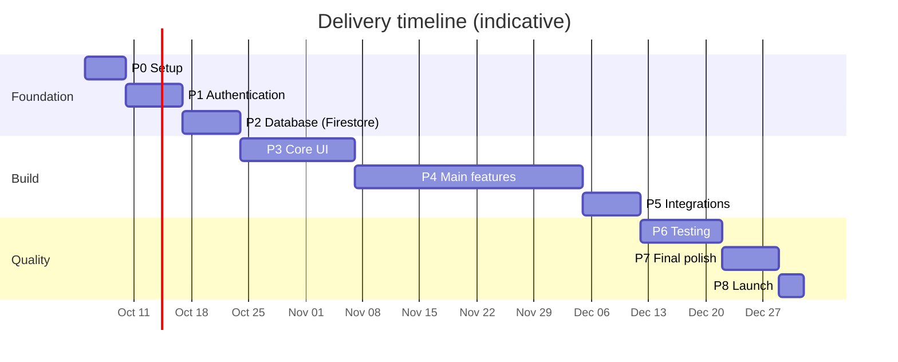

## Phase 0 — Setup (Days 1–5)
**Tasks:** create repo; Next.js 15 + TS strict + Tailwind + shadcn/ui; ESLint/Prettier/Husky; folder structure (§2.11); env validation (`zod` `env.ts`); **create Firebase project, enable Authentication (Email/Password + Google) and Firestore (production mode, region `asia-south1` Mumbai), upgrade to Blaze plan with a budget alert**; `firebase.json`, deny-all `firestore.rules`, empty `firestore.indexes.json`; Firebase Emulator Suite for local dev; Cloudinary account (folders + signed-upload setup); Vercel project + preview deploys; Sentry; GitHub Actions (lint, typecheck, test); split this file into `/docs/PRD.md`, `TRD.md`.
**Deliverables:** running app on Vercel preview · CI green · emulators start with one command · `.env.example` · `/docs` committed · README with setup steps.

## Phase 1 — Authentication (Days 6–12)
**Tasks:** Firebase client + Admin SDK; `/api/auth/session` (cookie), logout, `/me`; middleware guard; login/register/forgot pages (store theme) and admin login (admin theme); `users/{uid}` create-on-first-login; seed Super Admin; `requirePermission` helper + `roles` docs; staff invite flow (Super Admin creates staff → Firebase user + Firestore profile + reset-password email); rate limiting on auth routes.
**Deliverables:** customer register/login/logout works · admin login works · customer blocked from `/admin` (403) · role matrix enforced by unit tests · audit-log entry for role changes.

## Phase 2 — Database: Firestore (Days 13–19)
**Tasks:** implement all collections, TypeScript types, Zod schemas and **Firestore converters** (§5); `firestore.indexes.json`; counters helper (transactional numbering); **GST engine** + unit tests (intra/inter, inclusive/exclusive, rounding, HSN summary); **inventory service** (FEFO deduction, GRN → batches, adjustments, `stockAvailable`/`isLowStock` maintenance) with transaction tests on the emulator; `stats_daily` increment helpers + "Rebuild stats" tool; Cloudinary signed-upload endpoint + `media_assets`; seed script.
**Deliverables:** seed runs idempotently on the emulator · ≥ 90% unit-test coverage on `gst.ts`, `inventory.ts`, numbering, stats · schema diagram committed · rules test proving client access is denied.

## Phase 3 — Core UI (Days 20–33)
**Tasks:**
1. Design tokens + 3 themes (corporate/store/admin) in Tailwind config.
2. Shared component library (§4.6).
3. **Corporate layout:** announcement bar, header with **Shop → /shop**, full-screen menu, footer; all sections of §4.3 with CMS-driven placeholder data; Careers list/detail/apply UI.
4. **Store layout (separate):** header, footer, WhatsApp button; Store Home sections; Collections; Product card; Product page UI; Cart drawer; Checkout UI (COD + optional manual transfer step); Track Order; Login; Blogs list.
5. **Admin layout:** sidebar, top bar, DataTable, FormDrawer, dashboard skeleton with KPI/chart components.
6. Responsive + a11y pass; Lighthouse baseline.
**Deliverables:** every public page reachable and visually matching §4 · Shop button opens store layout · component preview page · mobile screenshots at 360/768/1280.

## Phase 4 — Main Features (Days 34–61)
Build in this order (each = API + admin UI + public UI + tests):

| Step | Feature | Deliverable |
|---|---|---|
| 4.1 | **Catalog admin** (categories, products, Cloudinary images, SEO, GST/HSN, flags, search keywords) | Admin adds product → appears on store |
| 4.2 | **Inventory** (batches, movements, adjustments, stock history, expiry view) | Ledger accurate; `stockAvailable` always equals batch sum |
| 4.3 | **Suppliers + Purchase** (PO workflow, approval, GRN → stock-in, supplier bills/payments) | Full PO → GRN → stock loop works |
| 4.4 | **Store browsing** (home data, collections, filters, search, product page, reviews, wishlist, pincode check) | Public store live with real data |
| 4.5 | **Cart & Checkout — COD + manual transfer** (cart sync, coupons, COD rules, transactional `placeOrder`, idempotency, 24 h auto-cancel for unpaid manual orders) | Order can be placed with COD; stock deducted atomically |
| 4.6 | **Orders & fulfilment** (admin queues, status flow, history, manual courier/AWB, confirm manual payment, mark COD collected, cancel/return/manual refund) | Order lifecycle (§3.4) works end-to-end |
| 4.7 | **GST invoicing** (auto invoice on CONFIRMED, PDF → Cloudinary, credit notes, numbering, HSN summary, manual B2B invoice from admin) | Invoice PDF correct to accountant sign-off |
| 4.8 | **CRM** (customers auto-created from orders, tags, interactions, leads pipeline, enquiries inbox) | Sales can track a lead to a customer |
| 4.9 | **Expenses** (categories, CRUD, receipts, recurring, weekly/monthly views) | Weekly & monthly expense views + totals |
| 4.10 | **Low-stock alerts** (`isLowStock`, cron, in-app badge, email digest, reorder suggestion → "Create PO") | Alert fires and links to PO |
| 4.11 | **Dashboard & Reports** (KPIs; weekly/monthly/yearly sales from `stats_daily`; GST; stock; expense; P&L-lite; CSV/XLSX/PDF export) | Report totals reconcile with raw orders (spot-check script) |
| 4.12 | **Careers** (admin job CRUD, public list/detail/apply, private CV upload, pipeline, emails) | Candidate applies → HR sees in pipeline |
| 4.13 | **CMS** (banners, pages, blogs, testimonials, settings) | Content editable without code |
| 4.14 | **Users, roles, audit log, settings, backups UI** | RBAC editable by Super Admin |

## Phase 5 — Integrations (Days 62–68)
**Tasks:** Resend email templates (order confirmed, shipped, delivered, invoice, low-stock digest, application received, password reset, contact acknowledgement); WhatsApp `wa.me` floating button; Cloudinary final transformations + private signed delivery (CVs, invoices, payment proofs); **Firestore backup export cron to GCS + PITR + lifecycle rules + restore drill**; Cloudflare Turnstile on public forms; analytics (Vercel/GA4 with consent); optional Shiprocket adapter *(only if wanted — manual shipping is the default)*.
**Not in this phase (deferred):** online payment gateway. The `PaymentProvider` interface already exists, so adding one later is a self-contained task.
**Deliverables:** emails render in Gmail/Outlook · nightly export visible in admin and a test restore into a scratch database succeeds.

## Phase 6 — Testing (Days 69–78)
- **Unit:** GST, FEFO deduction, numbering, permissions, stats increments.
- **Integration (Firebase Emulator):** `placeOrder` transaction — success, out-of-stock, concurrent orders on last unit (no oversell), double-submit idempotency, cancel/return reversal; GRN transaction.
- **E2E (Playwright):** (1) visitor clicks Shop → store layout; (2) guest buys with COD; (3) logged-in buys with manual transfer → admin confirms; (4) track order; (5) admin ships order and marks COD collected; (6) PO → GRN → stock up; (7) low-stock alert; (8) candidate applies → HR moves status; (9) role restrictions (Sales cannot open Users); (10) backup run.
- **Non-functional:** Lighthouse ≥ 90, load test checkout (k6, 30 concurrent), security scan (OWASP ZAP), Firestore rules test, dependency audit, accessibility (axe).
- **UAT:** accountant verifies 10 invoices and a month report; owner walks through admin.
**Deliverables:** test report · zero critical/high bugs · UAT sign-off.

## Phase 7 — Final Polish (Days 79–85)
Animations & micro-interactions; empty/error/loading states everywhere; copy review; image optimisation; SEO (meta, sitemap, JSON-LD, redirects); legal pages (Privacy, Terms, Delivery & Returns, Warranty, Legal Notice, Support); cookie consent; 404/500 pages; favicon/OG images; cross-browser and device checks; admin help tooltips; data-deletion request form; Firestore read-cost review (caching/ISR).
**Deliverables:** polished staging build · SEO checklist done · legal text approved by owner.

## Phase 8 — Launch (Days 86–88)
Production env vars; domain + SSL + DNS; real products/photos/GSTIN/bank & UPI details loaded; final backup + restore drill; monitoring/alerts and budget alerts on; Google Search Console + sitemap; runbook (`/docs/RUNBOOK.md`: deploy, rollback, Firestore restore, rotate keys, add a payment gateway later); handover training + video walkthrough.
**Deliverables:** live site · runbook · admin credentials handed securely · 30-day support plan.

## Phase exit checklist (every phase)
`pnpm lint` ✔ · `pnpm typecheck` ✔ · `pnpm test` (emulator) ✔ · indexes/rules deployed to preview ✔ · preview deploy ✔ · demo notes in `/docs/CHANGELOG.md` ✔

## Future roadmap (explicitly out of v1)
Online payment gateway (Razorpay or other) · Shiprocket live tracking · e-invoice IRN / e-way bill · WhatsApp/SMS notifications · loyalty/subscriptions · Tally export · Algolia/Typesense search.

---

# 7. APPENDIX — AI AGENT PROMPT PACK & DEFINITION OF DONE

## 7.1 Master prompt (paste first into Anti-gravity)
```
You are a senior full-stack engineer. The file Eastern_Biochemicals_Build_Specification.md is the single source of truth.
Rules: follow Section 0.3 strictly; build phase by phase per Section 6; do not skip ahead.
Stack: Next.js 15 App Router, TypeScript strict, Tailwind, shadcn/ui, Firebase Auth (client + Admin SDK session cookies), Firebase Firestore (server-side Admin SDK only, deny-all client rules), Cloudinary for all media, Resend for email.
Do NOT use SQL, Prisma, PostgreSQL or any online payment gateway. Payments = Cash on Delivery + optional manual UPI/bank transfer verified by admin, behind a PaymentProvider interface.
Three areas in one app: Corporate (/), Store (/shop, separate layout & theme, opened via the "Shop" nav button), Admin (/admin).
Use the Firebase Emulator Suite for development and tests.
At the end of each phase: run lint, typecheck, tests; summarise what was built, what is pending, and any assumptions in /docs/DECISIONS.md. Ask me only if blocked.
Start with Phase 0.
```

## 7.2 Per-phase prompts (short)
- **P1:** "Implement Phase 1 exactly as in §6 and §2.4–2.5. Create the session cookie flow, middleware, RBAC helper and tests."
- **P2:** "Implement all Firestore collections, types, Zod schemas, converters, indexes, seed, GST engine, inventory transactions and stats helpers from §5 with emulator tests."
- **P3:** "Build the UI per §4. Corporate and Store must use different layouts/themes. The Shop button in the corporate header links to /shop. Use placeholder data from the seed."
- **P4.x:** "Implement step 4.x from §6 including API, admin screens, public screens and tests. Follow the flows in §3."
- **P5:** "Add Resend emails, Firestore backup export cron, Turnstile, private Cloudinary delivery. Do not add a payment gateway."
- **P6/7/8:** "Write the tests listed in §6 Phase 6 / do the polish list / prepare launch runbook."

## 7.3 Definition of Done (project)
- [ ] Clicking **Shop** from the corporate nav opens the dedicated store with its own header/footer/theme.
- [ ] Corporate site sections match §4.3; store pages match §4.4.
- [ ] All 12 requested admin modules exist and are permission-protected (§1.4C, §2.5).
- [ ] Weekly, monthly and yearly sales reports + expense views work and export.
- [ ] Customers can order with **COD** (and manual transfer if enabled); no online gateway code is required.
- [ ] GST invoice is generated automatically for every confirmed order, with correct CGST/SGST/IGST and sequential numbering.
- [ ] Stock changes only through the ledger inside Firestore transactions; FEFO; no oversell under concurrency; low-stock alert verified.
- [ ] Careers: post job → candidate applies with CV → HR manages pipeline.
- [ ] Firebase auth + RBAC verified; customers cannot access admin; Firestore rules deny all client access.
- [ ] Cloudinary used for all media; CVs, invoices and payment proofs are private.
- [ ] Nightly Firestore export running and restore tested.
- [ ] Lighthouse ≥ 90; e2e suite green; no critical security findings.
- [ ] Legal pages, cookie consent, and age-gate/prescription flags configured per compliance advice.

---
*End of document.*
